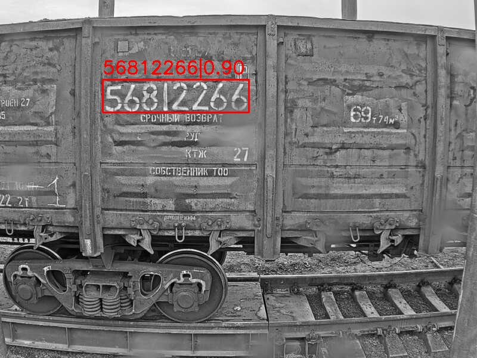

# iANRCRPython
Распознавание номеров жд вагонов. Использует TensorFlow 2 и может работать, как на GPU, так и на CPU. Использует Yolov5 в качестве модели распознавания.
## Оглавление
1. [Инсталляция](#Инсталляция)
2. [Инициализация](Инициализация)
3. [Распознавание отдельных изображений](#Распознавание-отдельных-изображений)
4. [Потоковое распознавание](#Потоковое-распознавание)
5. [Тесты производительности](#Тесты-производительности)
6. [Лицензия](#Лицензия)
7. [Использование под другой лицензией](#Использование-под-другой-лицензией)
8. [Дообучение](#Дообучение)
## Инсталляция
Требуется установка OpenCV и Tensorflow
```
 pip install -r requirements.txt
```
или
```
 pip install opencv-python
 pip install tensorflow
```
## Инициализация
Для инициализации нужно подключить **iANRCRSettings**:
```python
 import iANRCRSettings
```
Там определен путь до модели:
```python
 iANRCRDetectModelPath = "model/model01.pb"
```
Но вы можете перенести модель в другое место и задать путь самостоятельно:
```python
 import iANRCRSettings
 
 iANRCRSettings.iANRCRDetectModelPath = "/home/model01.pb"
```
Настройки библиотеки хранятся там же в **iANRCRConfig** и их можно не менять:
```python
 config = iANRCRSettings.iANRCRConfig()
```
Расшифровка настроек:
* detect_conf_thresh - пороговое значение детектора символов;
* detect_max_output_size - максимальное количество детектируемых символов;
* detect_iou_threshold - пороговое значение IoU
* detect_width - размер входного изображения  по ширине (должен соответствовать модели);
* detect_height - размер входного изображения  по высоте (должен соответствовать модели);
* types_of_object_detection - количество типов детектированных символов (10 - количество цифр);
* max_distance_between_charactersW - максимальное расстояние между символами по горизонтали при объединении в номер, измеряется в высотах символов;
* max_distance_between_charactersH - максимальное расстояние между символами по вертикали при объединении в номер, измеряется в высотах символов;
* min_symbols_in_number - минимальное количество символов в номере;
* correct_number - нужно ли проверять номер по корректирующему символу (РЖД);
* memory_number_frames - количество кадров с номерами в памяти (при потоковом распознавании);
* memory_number_repeat - сколько кадров в памяти должны быть с одним номером при потоковом возвращении.

Загрузка настроек и инициализация класса распознавания:
```python
 ia = iANRCR.iANRCR(config)
```
## Распознавание отдельных изображений
Показано в примере **imageSample.py**. Передавать на распознавание можно сразу несколько изображений:
```python
 image1 = cv2.imread("imagetest1.jpg")
 image2 = cv2.imread("imagetest2.jpg")    
```
Распознавание:
```python
 ia.process([image1,image2])
```
Вывод результатов в файл:
```python
 ia.draw_symbols([image1,image2],["imagetest1_out.jpg","imagetest2_out.jpg"])
```
Пример результата:



В том же примере представлен тест производительности - функция **SpeedTest()**

Также есть пример работы в гугл Colab: **iANRCRPython.ipynb**
## Потоковое распознавание
Полные возможности распознавания показаны в примере **videoSample.py**. Основные особенности примера:
* path - путь до видеофайла;
* divideW - параметр изменения изображения перед передачей на распознавание, 1 - не меняется, 2 - разрезается пополам по горизонтали и передается первая половина;
* draw_number - функция, которая рисует и текущий номер, и номер из памяти;
* get_numbers() - функция получения распознанных номеров текущего кадра из класса iANRCR;
* get_numbers_memory() - функция получения распознанных номеров с учетом памяти. Лучше использовать именно этот вариант, т.к. он надежнее.
## Тесты производительности
| Тип теста | Распознавание 1 кадра (sec) | 
|----------------|:---------:|
| CPU i7-6700 4GHz Windows | 0.3 |
| GPU RTX 2080 Super Windows | 0.05 |
| GPU Tesla P100 Linux| 0.037 |
| GPU RTX 3090 Linux| 0.023 |
## Лицензия
GNU General Public License v3.0
## Использование под другой лицензией
Со всеми вопросами на сайт [intbusoft.com](https://intbusoft.com)
## Дообучение
За отдельную плату мы можем дообучить и/или предоставить другую модель для распознавания символов. Также при необходимости можем перевести модель на движок TensorRT для конкретного устройства
